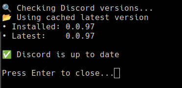

# Discord Updater


## What is this project?
The Discord Updater is a simple Bash script designed to check for and install the latest version of the Discord application on a Linux system. It automates the process of downloading the latest Discord `.deb` package from the official Discord website, installing it, and managing dependencies. The script includes a desktop entry for easy access via the application menu.

 


## User Instructions
### Prerequisites
- A Linux distribution with `dpkg` and `apt-get` (e.g., Ubuntu or Debian).
- `curl`, `wget`, and `jq` installed (`sudo apt-get install curl wget jq`).
- Administrative (sudo) privileges.

### Installation
1. Ensure all prerequisites are met.
2. Place the `install.sh`, `discord-updater.sh`, `discord-updater.desktop`, and `assets/discord-staff-badge.svg` files in the same directory.
3. Run the installation script:
   ```bash
   chmod +x install.sh
   ./install.sh
